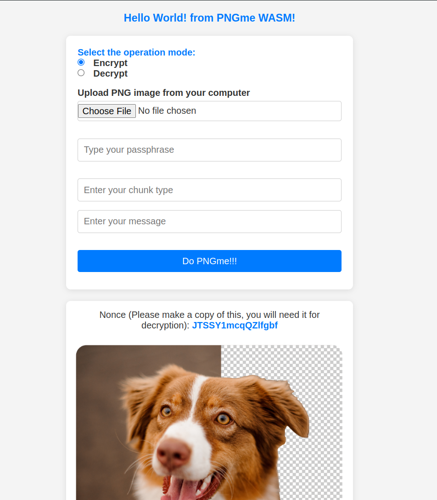

# pngme_wasm
pngme_wasm provides a WebAssembly (WASM) module for the PNGme project, enabling browser-based encoding and decoding of hidden messages within PNG files.

## Features
- Encode and decode PNG messages in the browser.
- WASM module for cross-platform usage.

## Installation
To include pngme_wasm in your project:
```bash
wasm-pack build
```

WASM package will be stored at `pkg/`

## Run the demo web app
```bash
cd www
npm install
npm run start
```

The web app should look like:

